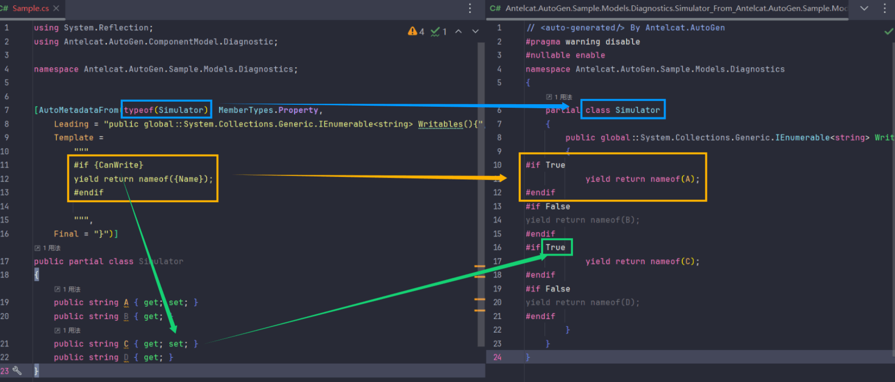
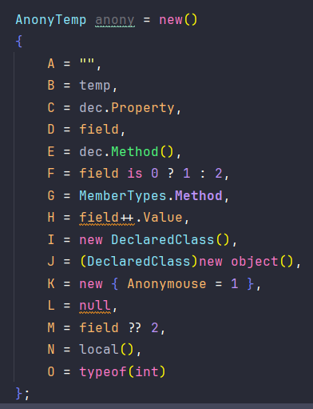
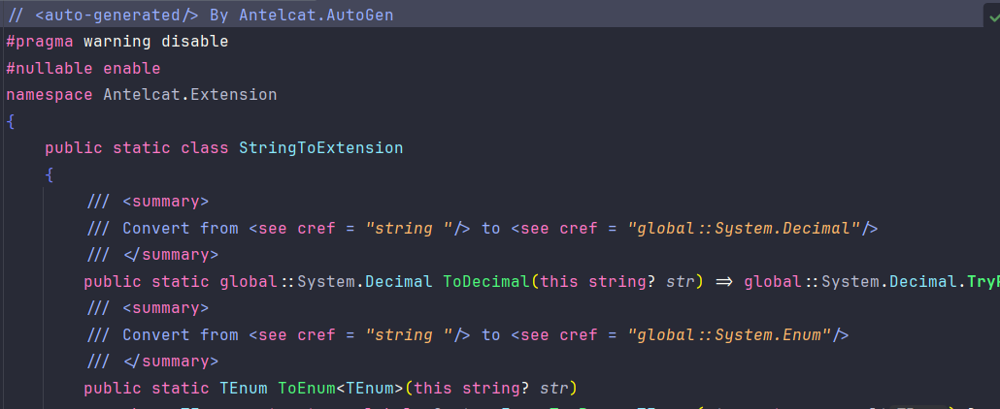
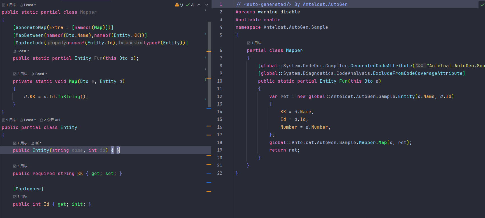
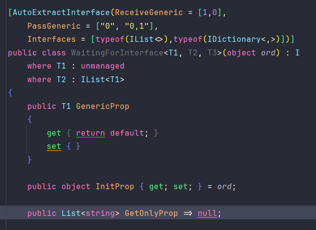
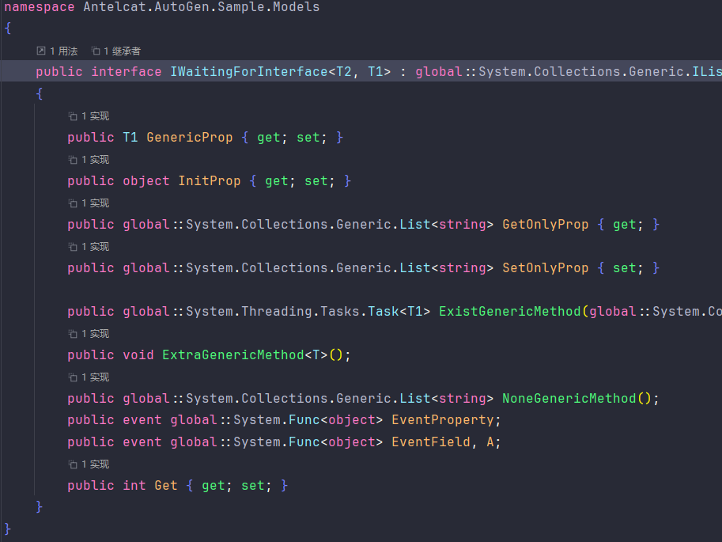

# Antelcat.AutoGen

🇨🇳 [中文](./README.zh.md)

Auto generate anything you may want
> ~~unless we can't~~

## Supported

### `Antelcat.AutoGen.ComponentModel` :  

+ #### `[AutoMetadataFrom(Type, MemberTypes)]` :
  
  Auto generate code using `Template` from target type members  

  

+ #### `[AutoTypeInference]` :
  
  Auto generate `Type` detected from `anonymous`object creation

  

+ #### `[AutoStringTo(string, Accessibility)]` :

    Auto generate string To extension

    only on `assembly` and `static partial class`

    

+ #### `Mapping` :  

  + #### `[AutoMap(Accessibility)]` :  

    Auto generate mappings between types

    > Only on `partial method`

    

    > You can use to generate `shallow copy`

  + #### `[MapBetween(fromProperty, toProperty)]` :  

    Specify property mapping between types

    + `By` : Method being called when mapping this property

  + #### `[MapIgnore]` :  

    To be ignored when generate mapping code

  + #### `[MapInclude(property)]` :  

    Explicit include properties when `[MapIgnore]`

  + #### `[MapExclude(string)]` :  

    To be excluded when mapping

  + #### `[MapConstructor(params string[])]` :  

    Specified property to be added in constructor, will auto-detect if `null`


+ #### `[AutoFilePath]`:
  
  Auto generate `FilePath` which is `ref readonly struct`

    ```csharp
    void Fun([CallerFilePath] string path = "")
    {
        var directory       = (FilePath)path << 1;
        var full            = directory / "Antelcat.AutoGen.Sample" / "Example.cs";
        var changeExtension = full - 2 + ".g.cs";
    }
    ``` 

+ #### `[AutoDeconstructIndexable]`:

  Auto generate `Deconstruct` method for `IList<>` and custom types

    ```csharp
    [assembly: AutoDeconstructIndexable(16/*default size is 16*/, typeof(Foo))]
  
    int[] list = [1,2,3];
    var (a, b, c) = list;
  
    class Foo{
        public object this[int index] => index;
    }
  
    var (a, b, c, d) = new Foo();
    ```

+ #### `[AutoExtendFor]`:

  Auto generate `this` extensions for `static` method in `static class`

  ```csharp
  class StaticClass
  {
      public static void Fun(int i) => Console.WriteLine(i);
  }
  
  [AutoExtendFor(typeof(StaticClass))]
  static partial class Extension;
  
  /// <generated>
  static partial class Extension
  {
      public static void Fun(this int i) => StaticClass.Fun(i); // call original method
  }

+ #### `[AutoKeyAccessor]`:

  Auto generate `object this[string key]` accessor

  ```csharp
  [AutoKeyAccessor]
  class Foo
  {
      public bool Property { get; set; }
  }
  
  /// <generated>
  partial class Foo
  {
      public object? this[string key]
      {
          get
          {
              switch (key)
              {
                  case nameof(this.Property): return this.Property;
              }
              return null;
          };
          set
          {
              switch (key)
              {
                  case nameof(this.Property): this.Property = (bool)value; break;
              }
          };
      }
  }
  ```

+ #### `[AutoUnmamagedArray]`

  Auto generate user defined length of array items, usually for `Marshal`

  ```csharp
  [AutoUnmamagedArray(nameof(T), 4)]
  struct CharArray<T> where T : unmanaged{}
  
  /// <generated>
  struct CharArray<T> where T : unmanaged
  {
      public T item0;
      public T item1; 
      public T item2;
      public T item3;
  
      public IEnumerable<T> Enumerate(){
          yield return item0;
          yield return item1; 
          yield return item2;
          yield return item3;
      }
  }
  ```

+ #### `[AutoExtractInterface]`

  Auto generate interface for specified type

  like :

  

  will generate

  
