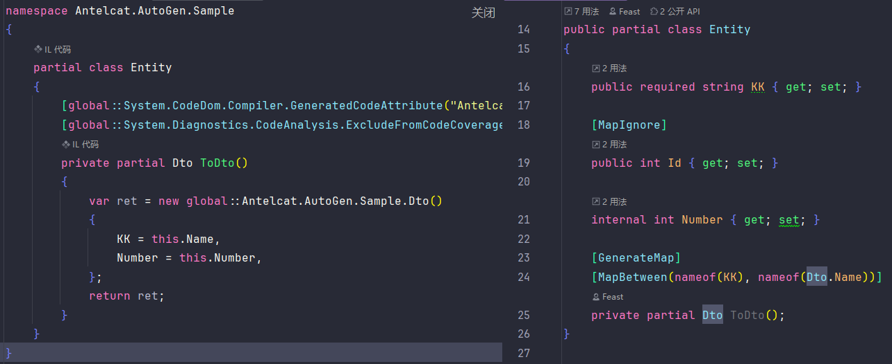

# Antelcat.AutoGen

🇨🇳 [中文](./README.zh.md)

Auto generate anything you may want
> ~~unless we can't~~

## Supported

### `Antelcat.AutoGen.ComponentModel` :  

+ #### `[AutoStringTo(string, Accessibility)]` :  

    Auto generate string To extension

    only on `assembly` and `static partial class`

    

+ #### `Mapping` :  

  + #### `[AutoMap(Accessibility)]` :  

    Auto generate mappings between types

    > Only on `partial method`

    

    > You can use to generate `shallow copy`

  + #### `[MapBetween(fromProperty, toProperty)]` :  

    Specify property mapping between types

    + `By` : Method being called when mapping this property

  + #### `[MapIgnore]` :  

    To be ignored when generate mapping code

  + #### `[MapInclude(property)]` :  

    Explicit include properties when `[MapIgnore]`

  + #### `[MapExclude(string)]` :  

    To be excluded when mapping

  + #### `[MapConstructor(params string[])]` :  

    Specified property to be added in constructor, will auto detect if `null`
